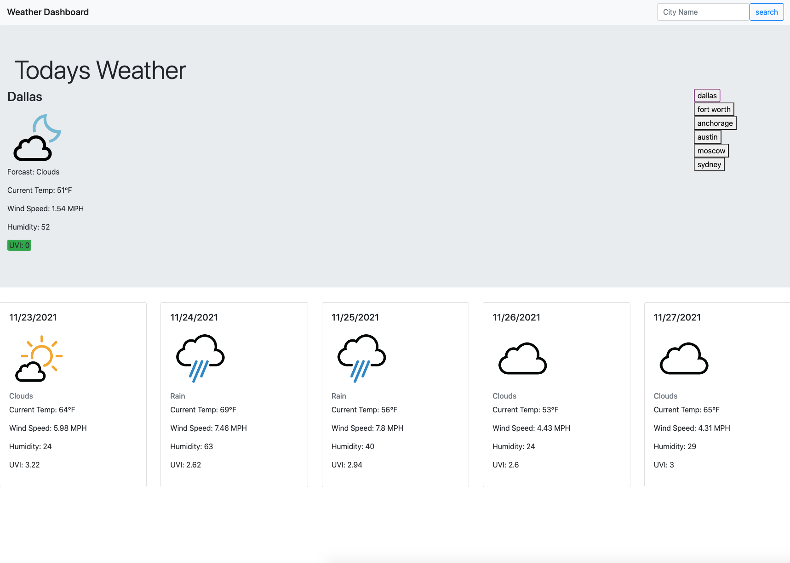
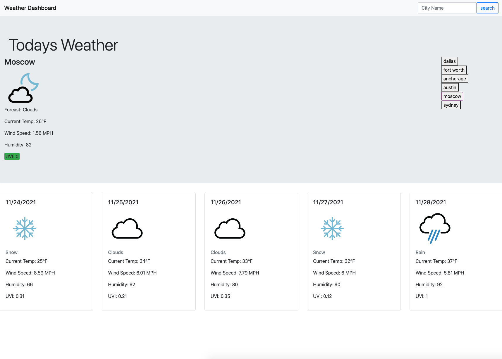

# 06 Weather Application

## Your Task

This is a weather app. All data is being pulled from openweathermap.org. displayed on the main page is the current weather of the searched city. beneath that is the 5 day forcast for the same city. when a city is searched, the name of that city is added to the local storage and displayed on the screen as a button. The same city will not be saved twice. 

## User Story

```
Below are screen shots and a link to my weather application.
https://dhoneyman.github.io/DailyEventPlanner/

```



