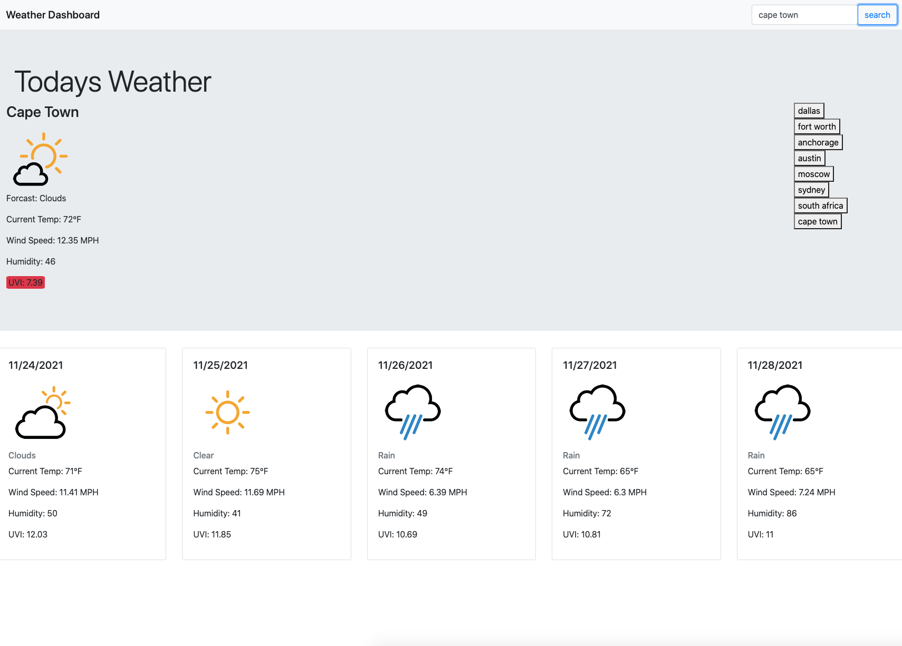

# Weather App 

A clean and simple weather app. 5 day forecast along with UV rating is presented for searched city. All searched cities are saved in a list on the right had side of the page in local storage for quick and easy access in the future.

## Table of Contents
<a href="#description">Description</a>

<a href="#installation">Installation</a>

<a href="#license">License</a>

<a href="#contributing">Contributing</a>

<a href="#Screen-Shots">Deployed Application</a>

<a href="#Deployed-Application">Deployed Application</a>

## Description
This app is created for anyone looking for a clean and simple weather app. Display five day forecast and UV ratings. Hold searched citied in a list to the right of the page.

## Installation
No dev dependencies.

## License
This application is covered under the MIT license.

## Contributing
Dylan Honeyman, just me on this one.

## Questions
GitHub Profile: <a href="https://github.com/dhoneyman">Dylan Honeyman</a>

## Screen-Shots

## Deployed-Application

Project GitHub Repository: https://github.com/dhoneyman/WeatherApp

Project Deployed Heroku Link: https://dhoneyman.github.io/WeatherApp/